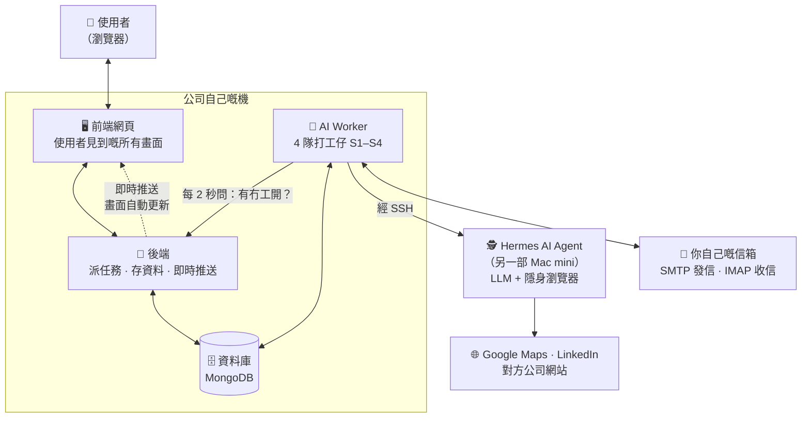
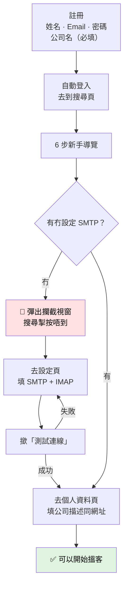
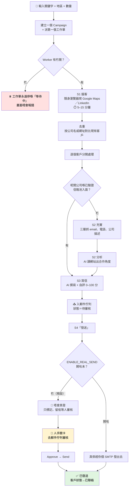
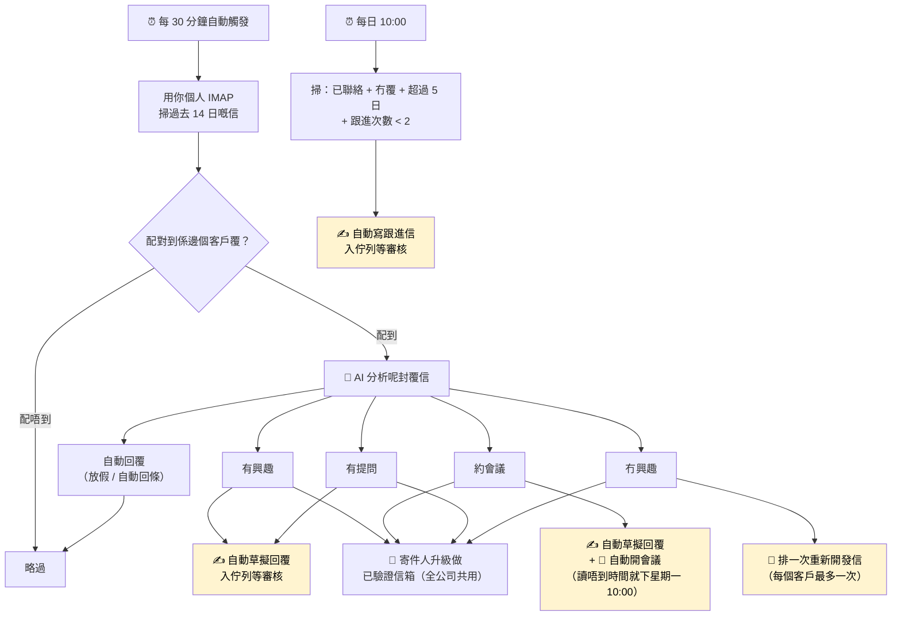
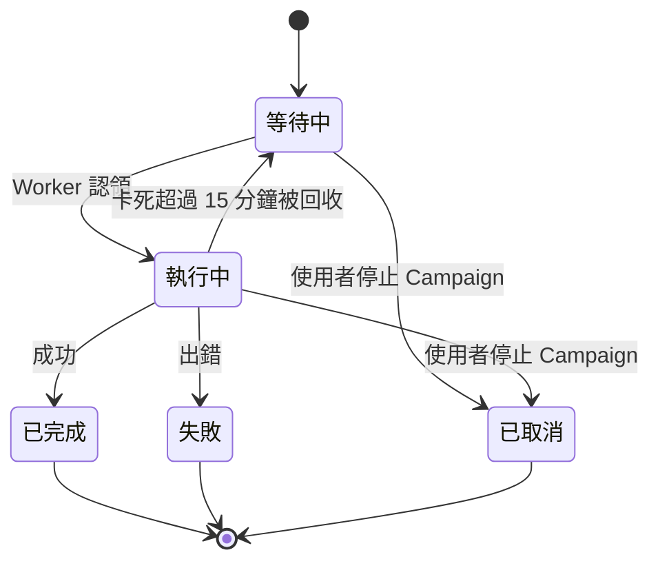
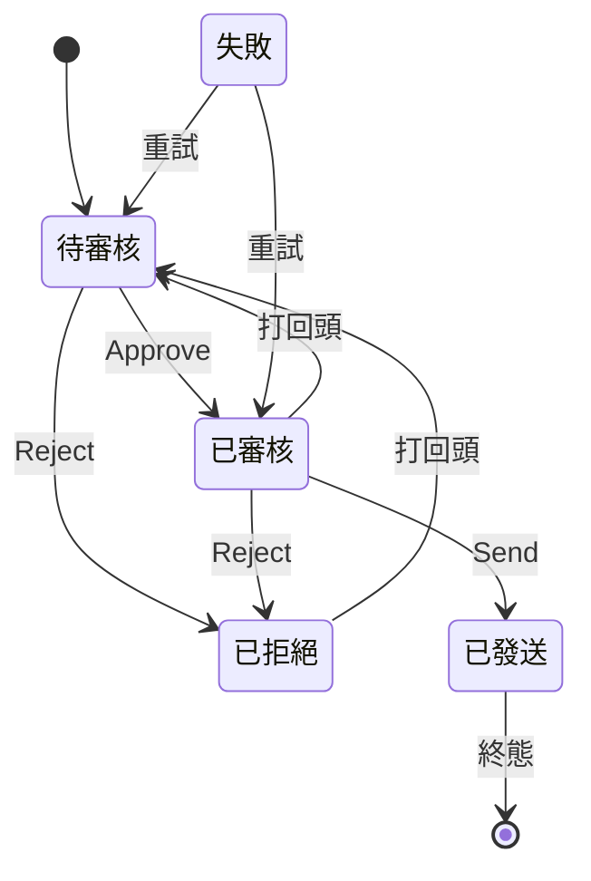
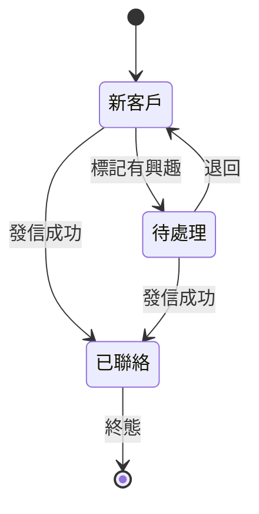

# ClientRadar AI — 產品說明報告

> **對象**：PM、QA、業務／管理層（非技術人員）
> **目的**：用白話解釋（1）呢個系統用嚟做咩（2）有咩功能（3）完整 App Flow
> **版本**：v1.0 · 2026-08-03
> **範圍**：以 `dev` branch 實際 code 為準

**同其他文件嘅分工**

| 文件 | 用途 | 睇邊份 |
|------|------|--------|
| **本文件** | 產品定位、功能清單、流程、QA 測試須知 | PM / QA / 管理層 |
| [`uat-functional-spec.md`](uat-functional-spec.md) | 功能對應 API route 同 worker function | 開發者 / 技術 QA |
| [`../PROJECT.md`](../PROJECT.md) | 安裝、環境變數、啟動指令 | 開發者 |
| [`../HANDOVER.md`](../HANDOVER.md) | 系統交接、資料庫欄位 | 接手團隊 |

**全文標記說明**

| 標記 | 意思 |
|------|------|
| ✅ | 功能完整可用，可以正常測試 |
| ⚠️ | 半成品：有 UI 但唔 work、或者做咗一半 |
| ❌ | 未實作：買返嚟嘅 admin template 殘留，**唔係本產品功能** |

---

## 目錄

- [第一部分：呢個系統用嚟做咩](#第一部分呢個系統用嚟做咩)
- [第二部分：有咩功能](#第二部分有咩功能)
- [第三部分：App Flow](#第三部分app-flow)
- [第四部分：QA 專區](#第四部分qa-專區)
- [附錄](#附錄)

---

# 第一部分：呢個系統用嚟做咩

## 一句話

**ClientRadar AI 係一個「AI 版業務開發員」。** 你打一句「牙科診所、九龍」，佢就會自動去 Google Maps 搵晒所有牙科診所、逐間去對方網站抓聯絡 email、讀完對方網站之後寫一封度身訂造嘅開發信、俾你審核、發出去、然後每半個鐘去你嘅信箱睇有冇人覆、有人覆就自動分類同建立會議、五日冇人覆就自動寫跟進信。

英文行內叫呢個角色做 **SDR（Sales Development Rep，業務開發代表）**。呢套系統做嘅就係將一個 SDR 由「搵名單」到「約到會議」之間嘅所有重複工作自動化。

> **產品名 vs 倉庫名**：倉庫叫 `email-agent`，內部有啲舊 code 叫 `hermes`，但**產品對外名叫 ClientRadar AI**。三個名指同一樣嘢。

## 解決咩問題

| 傳統人手做法 | ClientRadar AI |
|---|---|
| 開住 Google Maps 逐間 copy 公司名同電話，一日搵到幾十間 | 輸入關鍵字 + 地區，背景自動跑，一次過搵幾十至幾百間 |
| 逐間入網站搵 contact email，好多搵唔到 | 三層策略自動抓：直接爬網站 → 隱身瀏覽器搵 contact 頁 → 猜 `info@域名` |
| 逐間睇對方做咩生意，諗點樣切入 | AI 讀完對方網站，自動出「合作角度 + 建議方案」 |
| 逐封手寫 cold email，寫得攰就開始 copy paste 變罐頭 | AI 逐封獨立寫，仲會自我評分 0–100 分話你知封信好唔好 |
| 用 Excel 記住邊個發咗、邊個覆咗、邊個要跟進 | 系統自動記錄狀態，自動排跟進 |
| 逐封覆信自己讀、自己判斷、自己入 calendar | AI 自動分類（有興趣／冇興趣／約會議／自動回覆／有提問），約會議自動入行事曆 |

## 邊個用

| 角色 | 做咩 |
|------|------|
| **Sales / BD** | 日常主力使用者：搵客、審核 AI 寫嘅信、處理回覆 |
| **Marketing Manager** | 設定 AI 寫信嘅評分規則（語氣、長短、必須提到咩）、睇儀表板數據 |
| **Admin / Super Admin** | 管理團隊成員、系統設定、AI 並行數 |

> ⚠️ **重要**：權限系統目前**未真正生效**。任何登入用戶實際上入得晒所有頁面，只有少數幾個小部件同少量後端操作真係擋到。詳見 [已知問題 #13](#已知問題清單)。做權限相關測試前要知呢點。

## 產品邊界 —— 唔做咩

呢段對 PM 定 scope 好重要：

| 唔係 | 解釋 |
|------|------|
| ❌ **唔係群發 marketing 工具** | 冇「一封信發俾 5000 人」呢個概念。每封信都係 AI 針對嗰間公司獨立寫嘅，一對一。 |
| ❌ **唔係客服 inbox** | 系統會掃你信箱、分類回覆、草擬回覆，但唔係一個俾你日常收發信嘅 email client。 |
| ❌ **唔會自己偷偷發信** | 每封信都要人手撳 approve 先發得出去。呢個係設計上刻意留低嘅唯一人手關卡。 |
| ❌ **唔係 CRM 全套** | 有 lead 管理同行事曆，但冇報價單、合約、發票、pipeline 金額呢類完整 CRM 功能。 |
| ❌ **暫時淨係做得 email** | WhatsApp 有資料欄位同後端 API，但**冇 UI**，實際用唔到。 |

## 系統由咩組成

用比喻講：

| 組件 | 好似係 | 唔開會點 |
|------|--------|----------|
| **前端網頁** | 舖面 | 用戶開唔到網站 |
| **後端** | 老闆 —— 出工作單、記帳、通知 | 前端登入唔到，成個系統死 |
| **AI Worker** | 4 隊打工仔（S1 搵客／S2 抓資料同分析／S3 寫信／S4 發信收信） | **畫面唔會報錯，但所有任務永遠停喺「等待中」唔郁** |
| **Hermes AI Agent** | 出面請返嚟嘅偵探 —— 佢先有 AI 腦同埋隱身瀏覽器 | 搵客（S1）直接失敗。**呢部係另一部機，唔喺呢個 repo 入面** |
| **你自己嘅信箱** | 你張咭片 —— 系統用你個人 SMTP 發信、IMAP 收信 | 未設定就搵唔到客（系統會擋住你） |

> **QA 必記**：四樣嘢都要開齊先測試得。最容易撞板嘅係 Worker 或 Hermes 冇開 —— 畫面唔會彈錯誤，只係「一直轉圈但永遠冇結果」。

---

# 第二部分：有咩功能

## A. 帳號與個人設定

| 功能 | 使用者做到咩 | 喺邊 | 狀態 |
|------|-------------|------|------|
| 自助註冊 | 填姓名、email、密碼（最少 8 位）、**公司名稱（必填）**、公司描述 | `/register` | ✅ |
| 登入 | Email + 密碼登入，可以喺登入頁直接轉語言 | `/login` | ✅ |
| 保持登入 | 登入後 7 日內唔使再登入 | — | ✅ |
| 改密碼 | 輸入舊密碼 + 新密碼 | 個人資料頁 | ✅ |
| 個人資料 | 改姓名、email | `/cms-user-info` | ✅ |
| **公司資料** | 公司名、描述、網址 —— **呢啲會直接餵去 AI，係影響開發信品質嘅關鍵** | `/cms-user-info` | ✅ |
| 忘記密碼 | 撳咗會收到重設 email | `/login` | ⚠️ **email 入面條 link 冇對應頁面**，撳落去會彈返登入頁 |
| 團隊管理 | Admin 睇團隊成員、改角色 | `/cms-users` | ⚠️ 只可以改現有用戶，**冇「新增用戶」功能** —— 新成員只能自己註冊 |
| Gmail / Outlook 一鍵連接 | 免填 SMTP，直接授權連信箱 | — | ❌ 後端寫好晒但前端入口從未顯示，實際用唔到 |

## B. 搵客（核心入口）

| 功能 | 使用者做到咩 | 喺邊 | 狀態 |
|------|-------------|------|------|
| 關鍵字搜尋 | 輸入行業關鍵字（例：牙科診所） | `/cms-search` | ✅ |
| 地區選擇 | 香港 18 區下拉選單，或自由輸入 | `/cms-search` | ✅ |
| 目標數量 | 指定想搵幾多間 | `/cms-search` | ✅ |
| 來源選擇 | Google Maps／舊網站模式／Google Search／LinkedIn | `/cms-search` | ✅ |
| 即時進度 | 進度環 + 逐階段 log（搜尋→充實→分析→撰寫→發送），唔使 refresh | `/cms-search` | ✅ |
| 結果卡 | 搵到一間就即刻出一張卡 | `/cms-search` | ✅ |
| 中途停止 | 撳一下停晒成條線 | `/cms-search` | ✅ |
| 攔截提示 | 未設定 SMTP／Worker 冇開，會即時彈提示 | `/cms-search` | ✅ |
| 換機續看 | 開另一部電腦登入，仲睇到緊喺度跑嘅搜尋 | `/cms-search` | ✅ |

## C. 客戶資料自動充實

全部由 AI Worker 自動做，冇獨立畫面，結果顯示喺客戶詳情。

| 功能 | 做咩 | 狀態 |
|------|------|------|
| 三層 email 抓取 | ① 直接爬網站 → ② 隱身瀏覽器搵 contact／about／頁尾 → ③ 猜 `info@域名` | ✅ |
| 其他聯絡資料 | 電話、WhatsApp 號碼、公司描述、服務項目 | ✅ |
| 舊網站評分 | 自動評估對方網站有幾舊（`_tech_score`），舊 = 有得傾改版 | ✅ |
| AI 網站分析 | 讀完對方網站，出「合作方向 + 建議方案 + 理由 + 適合服務」 | ✅ |
| 已驗證信箱池比對 | 如果呢間公司之前已經有人成功聯絡過，直接攞返個 email，慳返充實同分析兩步 | ✅ |

## D. 客戶池管理

| 功能 | 使用者做到咩 | 喺邊 | 狀態 |
|------|-------------|------|------|
| 三個工作流分頁 | **AI 處理中** ／ **等你審核** ／ **已發送追蹤中**，每個有子篩選（待充實、待分析、草稿已備妥、等待回覆、已跟進、無回覆…） | `/client-pool` | ✅ |
| 搜尋與篩選 | 關鍵字、日期範圍、「只睇舊網站」、按技術分數排序、分頁 | `/client-pool` | ✅ |
| 客戶詳情 | 可拖曳／縮放嘅側面板：基本資料、客戶歷程時間軸、標籤、AI 分析（分數 + 合作方向）、回覆內容 | `/client-pool` | ✅ |
| 手動加客戶 | 自己輸入一間公司 | `/client-pool` | ✅ |
| 重跑某階段 | 對單一客戶重新做充實／分析／寫信 | 客戶詳情 | ✅ |
| 刪除 | 單筆刪除（軟刪除，可復原）／清空全部（Super Admin） | `/client-pool` | ✅ |
| 模擬無回覆 | 測試用：即刻觸發跟進信流程，唔使等 5 日 | `/client-pool` | ✅ **QA 好有用** |
| 自動更新 | 每 10 秒自動 refresh | `/client-pool` | ✅ |
| **已驗證信箱池** | 全公司共用嘅「確認可以聯絡到」信箱清單，可搜尋、新增、刪除、匯出 | `/client-pool?view=verified` | ✅ **注意係跨用戶共用** |

## E. AI 寫信

| 功能 | 使用者做到咩 | 狀態 |
|------|-------------|------|
| 自動撰寫開發信 | AI 綜合「對方公司資料 + 你嘅公司資料 + 評分規則」寫一封信 | ✅ |
| 信心分數 | 每封信 AI 自評 0–100 分，由 5 個維度加權計出 | ✅ |
| 評分規則設定 | 設定語氣、最短／最長字數、必須提到嘅要點、自訂指示 | ✅ |
| 跟進信 | 對 5 日冇回覆嘅客戶，自動寫一封較短、較親切嘅跟進信（最多 2 次） | ✅ |
| 重新開發信 | 對回覆「冇興趣」嘅客戶，換角度重寫一次（每個客戶最多一次） | ✅ |
| 自動回覆草稿 | 對方覆咗之後，AI 自動草擬一封「Re:」回覆，一樣入佇列等你審核 | ✅ |

## F. 郵件佇列（審核關卡）

> ⚠️ **呢一頁冇喺左邊側邊欄出現**。要入去只可以：喺頂部搜尋框打「Outbox / 寄件匣」，或者直接打網址 `/cms-email-queue`。**呢個係整個產品最重要嘅人手關卡，但最難搵到。**

| 功能 | 使用者做到咩 | 狀態 |
|------|-------------|------|
| 佇列列表 | 按狀態篩選（全部／待審核／已審核／已拒絕／已發送／失敗）、搜尋 | ✅ |
| 預覽草稿 | 睇主旨 + 內文 + AI 信心分數 + AI 摘要 | ✅ |
| 編輯 | 直接改主旨同內文 | ✅ |
| 逐封審核 | Approve（通過）／Reject（拒絕，可填原因）／Send（發送） | ✅ |
| 手動觸發 | 「檢查回覆」「檢查跟進」兩個掣，唔使等排程 | ✅ **QA 好有用** |
| 回覆分類顯示 | 睇到 AI 對回覆嘅分類、摘要、語氣、建議下一步 | ✅ |
| **批量審核／發送** | 多選之後一次過 Approve / Reject / Send | ⚠️ **必定失敗** —— 前端叫緊三個後端唔存在嘅位址，一定 404 |
| 郵件範本編輯器 | 圖文編輯、插入變數（收件人名、公司名…）、即時預覽、分類 | ⚠️ **唔會儲存** —— 只存喺記憶體，refresh 即消失 |

## G. 回覆追蹤

| 功能 | 做咩 | 狀態 |
|------|------|------|
| IMAP 掃信箱 | 每 30 分鐘用你自己嘅信箱憑證掃過去 14 日嘅信 | ✅ |
| 配對寄件人 | 按寄件地址配對，配唔到就用主旨反查 | ✅ |
| AI 分類回覆 | 分 5 類：有興趣／冇興趣／約會議／自動回覆／有提問 | ✅ |
| 自動草擬回覆 | 有興趣／約會議／有提問 → 自動寫一封回覆入佇列 | ✅ |
| 自動建立會議 | 分類做「約會議」→ 自動喺行事曆開一個事件（AI 讀唔到時間就預設下星期一 10:00） | ✅ |
| 自動升級信箱 | 有真人回覆過嘅地址，自動加入已驗證信箱池 | ✅ |

## H. 自動跟進

| 功能 | 做咩 | 狀態 |
|------|------|------|
| 無回覆跟進 | 每日 10:00 掃「已聯絡但超過 5 日冇覆」→ 自動排跟進信（每個客戶最多 2 次） | ✅ |
| 冇興趣重試 | 覆「冇興趣」→ 自動排一次換角度重新開發 | ✅ |

## I. 定期排程

| 功能 | 使用者做到咩 | 喺邊 | 狀態 |
|------|-------------|------|------|
| 建立排程 | 設定定期自動執行嘅工作 | `/cms-schedules` | ✅ |
| 頻率設定 | 每日／平日／每週／每 N 小時／每 N 分鐘／進階 cron | `/cms-schedules` | ✅ |
| 開關與即時執行 | 啟用／停用切換、「立即執行」掣 | `/cms-schedules` | ✅ |
| 執行狀態 | 睇上次執行時間、下次執行時間、結果 | `/cms-schedules` | ✅ |
| 排程類型 | 搜尋／完整流程／檢查回覆／檢查跟進 | `/cms-schedules` | ✅ |
| 排程類型：**發送已審核** | — | `/cms-schedules` | ⚠️ **必定失敗** —— Worker 冇對應處理邏輯 |

## J. 監控與數據

| 功能 | 使用者做到咩 | 喺邊 | 狀態 |
|------|-------------|------|------|
| AI 村莊 | 遊戲風介面：4 隻 AI agent 動物角色（S1 狐狸／S2 牛／S3 鵝／S4 鸚鵡）、3D 等距視圖、即時活動 log、統計、快速搜尋、今日行事曆告示板 | `/cms-agents` | ✅ |
| 任務看板 | 待處理／處理中／已完成／失敗 四欄，撳入去睇每步時間軸同錯誤詳情 | `/cms-tasks` | ⚠️ **永遠混住 5 條寫死嘅假任務**；且**冇側邊欄入口** |
| 儀表板 | Token 用量圖表、今日行程、待辦卡（待審核草稿／新回覆／待確認會議）、轉換漏斗、回覆分類圓餅圖、近期活動 | `/dashboard` | ⚠️ 帳戶冇資料時**自動顯示模擬數據**（有 banner 標示） |
| Token 用量 | 睇 AI 用咗幾多 token、成本計算機 | `/cms-users` Token 分頁 | ✅ Admin 限定。**注意數字係估算，唔係供應商實報** |
| 行事曆 | 月／週檢視、迷你月曆、日詳情、今日行程 | `/app-calendar` | ⚠️ **只睇得，加唔到、改唔到** —— 只顯示 Worker 自動建立嘅事件 |

## K. 系統設定

| 功能 | 使用者做到咩 | 狀態 |
|------|-------------|------|
| **個人 SMTP / IMAP** | 填自己信箱嘅發信同收信設定 —— **唔填就用唔到搜尋** | ✅ |
| 連線測試 | 撳一下測試 SMTP + IMAP 通唔通 | ✅ |
| AI Agent IP | 設定 Hermes 機器位址 | ✅ Admin 限定 |
| 並行數 | 調整 S1–S4 各自同時處理幾多個任務（1–10），約 30 秒生效，唔使重啟 | ✅ Admin 限定 |
| 郵件評分規則 | 語氣、字數範圍、必含要點、自訂指示 | ✅ |
| 通知偏好 | 完成時發 email／瀏覽器通知、通知信箱 | ✅ |
| 「跟進設定」分頁 | — | ⚠️ **假 UI**，Save 掣係灰嘅，冇任何嘢會儲存 |
| 「自動發送規則」分頁 | — | ⚠️ **假 UI**，同上 |
| WhatsApp 訊息範本 | — | ❌ 後端 API 做好，設定頁只有一行註解，**冇 UI** |

## L. 使用體驗

| 功能 | 說明 | 狀態 |
|------|------|------|
| 三語介面 | 繁體中文（預設）／簡體中文／English，頂部同登入頁都轉得 | ✅ |
| 深／淺色主題 | 頂部切換，記住選擇 | ✅ |
| 新手導覽 | 6 步聚光燈教學（歡迎→AI 代理→告示板→客戶池→你嘅助手→完成），可重開 | ✅ |
| 即時更新 | 背景做完一步，畫面即刻自動更新，唔使 refresh | ✅ |
| 通知中心 | 頂部鈴鐺、未讀數、標記已讀、清除 | ✅ |
| 全域搜尋 | 頂部搜尋框可以搵頁面／客戶／郵件／任務 | ✅ **入 Outbox 同 Tasks 嘅唯一途徑** |
| 瀏覽器推播 | Web Push 通知 | ✅ |
| 響應式 | 手機 / 平板 / 桌面都用得，手機有側邊抽屜 | ✅ |

---

# 第三部分：App Flow

## Flow 1 — 新用戶第一次用

| 步驟 | 使用者見到 | 系統做緊 | 預期結果 |
|---|---|---|---|
| 1 | 註冊表格 | 密碼加密儲存，角色預設 `staff`，即時發登入憑證 | 註冊完直接入到系統，唔使再登入一次 |
| 2 | 搜尋頁 + 新手導覽 | — | 導覽可以撳 `?` 重開 |
| 3 | **攔截視窗「SMTP 未設定」** | 系統定期問後端「呢個用戶設定咗未」 | **未設定 SMTP 就搜尋唔到、亦加唔到客戶** |
| 4 | 設定頁填發信／收信資料 | 儲存到個人帳戶 | — |
| 5 | 撳「測試連線」 | 真係去連 SMTP 同 IMAP | 成功／失敗即時回報 |
| 6 | 個人資料頁填公司描述 | 存起 | **呢啲字會逐字餵去 AI 寫信 —— 填得差，出嚟嘅信就差** |

> **QA 重點**：呢個系統**冇 onboarding wizard**。唯一真正嘅關卡係 SMTP。公司描述雖然唔強制，但直接影響 AI 輸出品質，測試信件品質前一定要填。

---

## Flow 2 — 主線：由搜尋到發信

| # | 使用者見到 | 系統做緊 | 預期結果 / 耗時 |
|---|---|---|---|
| 1 | 撳「搜尋」，進度環開始轉 | 建立 Campaign，派一張 S1 工作單 | 即時 |
| 2 | 進度 log 逐行出：「搜尋中…」 | S1 Worker 每 2 秒問後端攞工作單，攞到就開工 | **5–15 分鐘，唔好當佢 hang 咗** |
| 3 | 「搵到 N 間公司」 | 用隱身瀏覽器爬，然後按公司名／網址去重 | 重複嘅會 skip 唔會重複入庫 |
| 4 | 進度變「充實中」 | 每間公司分開跑，命中已驗證信箱池就跳過充實同分析 | 命中就快好多 |
| 5 | 「分析中」 | AI 讀對方網站出合作角度 | — |
| 6 | 「撰寫中」 | AI 寫信 + 5 個維度評分 | 信入咗郵件佇列，狀態＝待審核 |
| 7 | 「發送中」→「完成」 | ⚠️ 預設**唔會真發**，只標記完成 | **信仍然喺佇列等人審核** |
| 8 | 結果卡出齊 | Campaign 標記完成 | 若通知偏好開咗，會收到總結 email |
| 9 | 👤 去郵件佇列（頂部搜尋「Outbox」） | — | 睇草稿、改、Approve |
| 10 | 撳 Send | 經你個人 SMTP 發出 | 郵件→已發送，客戶→已聯絡 |

**分支同例外**

| 情況 | 系統點做 |
|------|----------|
| 某一步失敗 | 自動重試最多 2 次；仲係失敗就**跳過呢個客戶**，但 Campaign 照計數，唔會卡死 |
| 完全搵唔到結果 | S1 刻意報「失敗」而唔係「完成 0 間」，等你知係出事而唔係真係冇客 |
| 中途撳停止 | Campaign 同所有未做嘅工作單一齊標記「已取消」；已取消嘅**唔會被自動回收機制救返** |
| 任務卡死超過 15 分鐘 | 每 10 分鐘一次嘅回收機制會將佢掉返去「等待中」重新排隊 |
| 某個客戶漏咗某一步 | 每 10 分鐘一次嘅「補漏」機制會掃描並補派（每次最多 20 個） |

> **PM 重點**：整條線只有**第 9–10 步**係人手。其餘全自動。呢個係產品最大賣點，亦係最大風險 —— 一旦 `ENABLE_REAL_SEND` 開咗，AI 寫嘅信就會直接出街。

---

## Flow 3 — 回覆處理與自動跟進

| 分類 | 草擬回覆？ | 開會議？ | 重新開發？ | 升級信箱？ |
|------|:---:|:---:|:---:|:---:|
| 有興趣 | ✅ | ✗ | ✗ | ✅ |
| 約會議 | ✅ | ✅ | ✗ | ✅ |
| 有提問 | ✅ | ✗ | ✗ | ✅ |
| 冇興趣 | ✗ | ✗ | ✅（限一次） | ✅ |
| 自動回覆 | ✗ | ✗ | ✗ | ✗ |

> **重要**：所有 AI 草擬嘅回覆同跟進信，**一樣要入郵件佇列俾人審核**，唔會自動出街。

> **QA 提示**：唔想等 30 分鐘／5 日，可以用郵件佇列頁嘅「檢查回覆」「檢查跟進」兩個掣，或者客戶池嘅「模擬無回覆」。

---

## Flow 4 — 背景自動排程

呢啲冇任何 UI，但會令資料自己變。QA 測試時見到「我冇做過嘢但數字變咗」，多數就係呢度。

| 頻率 | 做咩 | 對 QA 嘅影響 |
|------|------|-------------|
| **每 10 分鐘** | 回收卡死超過 15 分鐘嘅任務，掉返去排隊 | 一個「卡住」嘅任務可能自己郁返 |
| **每 10 分鐘** | 翻新等超過 30 分鐘嘅任務，避免餓死 | — |
| **每 10 分鐘** | **補漏**：掃客戶，補做漏咗嘅階段（每次最多 20 個） | **你手動刪咗嘅中間狀態可能自己補返** |
| **每 30 分鐘** | 排一次回覆檢查 | 信箱有新信會自動被讀同分類 |
| **每日 10:00** | 排一次跟進檢查 | 跟進信會自己出現喺佇列 |
| **每分鐘** | 檢查用戶自訂排程有冇到期 | 排程最多遲一分鐘觸發 |

> ⚠️ 另有一個「示範模式」開關，會將回覆檢查由 30 分鐘縮到 **10 秒**。呢個開關**冇 UI**，只可以由後端切換，重啟就會 reset。做效能測試前要確認佢係關住。

---

# 第四部分：QA 專區

## 狀態機速查

### 任務狀態

**「失敗」同「已取消」意思唔同**：失敗＝跳過呢個客戶但成條線繼續；已取消＝成條線停晒，而且**唔會被自動回收機制救返**。

### 郵件狀態

- 只有**待審核**同**已審核**兩個狀態改得內容
- **已發送**係終態，改唔到亦退唔到
- ⚠️ 系統有兩條發信路徑：使用者由畫面撳 Send（嚴格照上面規則）、同 Worker 自動發（會由待審核直接寫成已發送，跳過規則）。兩條都要測。

### 客戶狀態

「新客戶」喺資料庫入面實際存做空值（沿用舊系統格式）。另有一個獨立嘅資料驗證狀態，同呢個唔同軸，唔好搞亂。

### 其他列舉值

| 類別 | 可能值 |
|------|--------|
| Campaign | 執行中 → 已完成 ／ 已取消 |
| 回覆分類 | 有興趣 · 冇興趣 · 約會議 · 自動回覆 · 有提問 |
| 信箱驗證方式 | 收到 2 封真人回覆 · 1 封回覆 + AI 判斷係真人 · 人手加入 |
| 行事曆事件類型 | 會議 · 跟進 · 死線 · 其他 |
| 排程執行結果 | 已派發 · 失敗 —— **「已派發」只代表工作單出咗，唔代表跑得成功** |

## 測試前必讀 6 件事

1. **`ENABLE_REAL_SEND` 預設係關**。唔開就唔會真係發信出街 —— 呢個係安全掣，測試環境應該保持關住。
2. **`TEST_RECIPIENT_EMAIL` 會截住所有郵件**，而且係**喺 AI 寫草稿嗰一刻就將收件人寫死**，唔係發信先轉。即係話：改咗呢個設定，之前寫好嘅草稿仍然指住舊地址。主旨會加 `[TEST→原本地址]` 前綴。
3. **Worker 冇開 → 畫面唔會報錯**，任務只係永遠停喺「等待中」。搜尋頁會提示「冇 Worker 上線」，但其他頁唔會。
4. **Hermes（另一部機）冇開 → 搵客直接失敗**。呢部機唔喺呢個 repo，要另外確認。
5. **一次搜尋要 5–15 分鐘**。唔好當佢 hang 咗就報 bug。
6. **後端同 Worker 都必須只開一個 instance**。開多過一個會令所有定時任務重複觸發、工作單被搶。

## 已知問題清單

> 用戶已確認要詳細列出。**首 4 項會直接令 QA 開錯 bug**，請先睇。

### 🔴 唔好開 bug（設計如此／template 殘留）

| # | 情況 | 說明 |
|---|------|------|
| 1 | **約 30 個「建設中」頁面** | `/app-chat`、`/app-kanban`、`/portfolio`、`/bank-accounts`、`/transactions`、`/account-billing`、`/auth-404`、`/docs`… 全部係買返嚟嘅 LUNO admin template 殘留。**冇喺側邊欄出現**，但打網址入到。**唔係本產品功能。** |
| 2 | **`/app-email` 同 `/app-contacts` 係純靜態 demo** | 前者係完整 webmail 介面（收件匣、草稿、撰寫、排程寄出），後者係客戶表 —— 兩個都**完全冇接後端**，睇落好完整但撳落去咩都唔會發生。 |
| 3 | **側邊欄只有 8 個入口** | 搵客 · 儀表板 · 客戶池 · 行事曆 · AI 代理 · 排程 · 團隊 · 設定。**郵件佇列同任務看板冇入口**（要用頂部全域搜尋），**個人資料頁完全冇任何連結**（只可打網址 `/cms-user-info`）。 |
| 4 | **已驗證信箱池係跨用戶共用** | 設計如此。A 用戶確認到嘅聯絡人，B 用戶下次搜尋會直接攞嚟用。唔係資料外洩 bug。 |

### 🟠 真係壞咗（值得開 ticket）

| # | 問題 | 影響 |
|---|------|------|
| 5 | **批量 Approve / Reject / Send 必定 404** | 前端叫 `/email-queue/bulk-approve`、`/bulk-reject`、`/bulk-send`，後端三個都冇。已核實。多選之後撳掣一定失敗。 |
| 6 | **排程類型「發送已審核」必定失敗** | 後端派得出工作單，但 Worker 冇對應處理邏輯，會 fall through 去一般發信邏輯然後 crash。已核實。 |
| 7 | **忘記密碼條 link 冇對應頁面** | Email 照發、後端接收 API 照 work，但前端冇 `/reset-password` 呢個頁，撳落去會彈返登入頁。整個重設密碼流程實際行唔通。 |
| 8 | **Gmail / Outlook 一鍵連接完全用唔到** | 後端 OAuth、測試發信、解除連接全部寫好，但前端入口組件 import 咗之後從未顯示；後端 controller 本身亦有欄位名同守衛缺失問題。 |
| 9 | **任務看板混住假資料** | 永遠會見到 5 條寫死嘅假任務混喺真資料入面。 |
| 10 | **郵件範本編輯器唔會儲存** | 只存喺瀏覽器記憶體，refresh 即消失。 |
| 11 | **設定頁兩個分頁係假 UI** | 「跟進設定」同「自動發送規則」的 Save 掣係強制 disabled，填咗都唔會存。 |
| 12 | **WhatsApp 範本冇 UI** | 後端 API 做好晒，設定頁只有一行註解，冇任何介面。 |
| 13 | **權限系統未生效** | 細粒度權限檢查永遠放行；管理員路由守衛雖然寫咗但冇任何路由用到。實際結果：**任何登入用戶都入得晒所有頁面**。只有幾個小部件（設定頁 AI Agent 分頁、Token 用量分頁、客戶來源欄）同少量後端操作（改系統設定、用戶管理、清空所有客戶）真係擋到。**做權限測試冇意義，直到呢項修好。** |
| 14 | **行事曆加唔到嘢** | 後端有完整增刪改查，但 UI 只接咗「讀取」。只睇得 Worker 自動建立嘅事件。另外 Worker 建立事件時冇寫入用戶識別，可能導致事件顯示唔到。 |
| 15 | **Dashboard 會顯示假數據** | 帳戶零客戶零郵件時自動切換成模擬數據（有 banner 標示）。測試空帳戶時唔好當佢係真數字。 |

### 🟡 需要留意

| # | 情況 |
|---|------|
| 16 | Token 用量係**字元數估算**，唔係 AI 供應商實報數字，唔好當帳單用 |
| 17 | 大部分日期喺資料庫存做文字而唔係日期格式（沿用舊 Python 系統），日期排序／篩選可能有 edge case |
| 18 | 後端同 Worker 兩邊都會寫同一個資料庫，Worker 有時繞過後端驗證直接寫 |
| 19 | 幾個內部通訊位址冇加驗證（工作單認領、即時推送）—— 內網環境要留意 |
| 20 | 「新增用戶」功能唔存在，團隊新成員只能自己去註冊頁註冊 |

## 測試環境檢查清單

| # | 要開嘅嘢 | 點確認 |
|---|---------|--------|
| 1 | 後端（4000 埠） | 開 `<主機>:4000/api/health`，應該回 ok |
| 2 | 前端（5173 埠） | 瀏覽器開得到登入頁 |
| 3 | AI Worker | 搜尋頁**冇**顯示「冇 Worker 上線」警告；或者 `/cms-agents` 見到 4 隻 agent 有活動 |
| 4 | Hermes 機（另一部 Mac mini） | 跑一次搜尋，S1 唔係即刻失敗 |
| 5 | 個人 SMTP / IMAP | 設定頁撳「測試連線」兩項都綠 |
| 6 | `ENABLE_REAL_SEND` | 確認係關（除非刻意測真發信） |
| 7 | 示範模式 | 確認係關（否則回覆檢查每 10 秒跑一次） |

---

# 附錄

## A. 名詞對照表

| 英文 | 中文 | 白話解釋 |
|------|------|----------|
| Lead | 線索 / 客戶 | 一間潛在客戶公司 |
| Campaign | 活動 | 一次搜尋任務，包住佢搵到嘅所有客戶 |
| Pipeline | 流水線 | 由搵客到發信嘅完整自動流程 |
| S1 / S2 / S3 / S4 | 四隊 AI 工人 | S1 搵客 · S2 抓資料+分析 · S3 寫信 · S4 發信+收信 |
| Enrich | 充實 | 幫已搵到嘅公司補齊 email、電話等聯絡資料 |
| Analyze | 分析 | AI 讀對方網站，出合作角度 |
| Draft | 草稿 | AI 寫好但未發嘅信 |
| Outreach | 開發 / 外展 | 主動聯絡陌生潛在客戶 |
| Follow-up | 跟進 | 對方冇覆之後再發嘅信 |
| Re-outreach | 重新開發 | 對方話冇興趣之後換角度再試一次 |
| Verified Email Pool | 已驗證信箱池 | 全公司共用嘅「確認聯絡到」信箱清單 |
| Confidence Score | 信心分數 | AI 對自己寫嗰封信嘅自評（0–100） |
| SMTP / IMAP | 發信 / 收信協定 | SMTP＝寄信出去，IMAP＝讀返信箱 |

## B. 畫面總覽

### 真實功能頁面

| 畫面 | 網址 | 入口 | 狀態 |
|------|------|------|------|
| 登入 | `/login` | — | ✅ |
| 註冊 | `/register` | 登入頁 | ✅ |
| **搵客** | `/cms-search` | 側邊欄 · **預設首頁** | ✅ |
| 我的儀表板 | `/dashboard` | 側邊欄 | ⚠️ 空帳戶顯示模擬數據 |
| 客戶池 | `/client-pool` | 側邊欄 | ✅ |
| 已驗證信箱 | `/client-pool?view=verified` | 客戶池分頁 | ✅ |
| 行事曆 | `/app-calendar` | 側邊欄 | ⚠️ 唯讀 |
| AI 代理 | `/cms-agents` | 側邊欄 | ✅ |
| 排程 | `/cms-schedules` | 側邊欄 | ⚠️ 一種類型必失敗 |
| 團隊管理 | `/cms-users` | 側邊欄 | ⚠️ 加唔到新用戶 |
| 系統設定 | `/cms-settings` | 側邊欄 | ⚠️ 兩個分頁係假 UI |
| **郵件佇列** | `/cms-email-queue` | ⚠️ **只有頂部全域搜尋** | ⚠️ 批量掣壞 |
| 任務看板 | `/cms-tasks` | ⚠️ **只有頂部全域搜尋** | ⚠️ 混住假資料 |
| 個人資料 | `/cms-user-info` | ❌ **冇任何連結，要打網址** | ✅ |

### 非功能頁面

| 類別 | 例子 | 狀態 |
|------|------|------|
| Template 殘留（約 30 個） | `/app-chat` `/app-kanban` `/app-todo` `/portfolio` `/transactions` `/bank-accounts` `/account-billing` `/docs` … | ❌ 顯示「建設中」 |
| 靜態 demo 介面 | `/app-email`（webmail）· `/app-contacts`（客戶表） | ❌ 睇落完整但冇接後端 |
| 舊版轉址 | `/cms-leads` → `/client-pool` · `/cms-verified-emails` → `/client-pool?view=verified` | ✅ |
| 找唔到嘅網址 | 任何其他 | 自動轉去 `/cms-search` |

## C. 支援語言

| 語言 | 狀態 |
|------|------|
| 繁體中文 | ✅ **預設** |
| 简体中文 | ✅ |
| English | ✅ |

介面文字全部三語齊備。地區選擇器內建香港 18 區，主要市場係香港。

---

*本報告由 code 直接核實撰寫，日期 2026-08-03。功能狀態會隨開發變化，重大改動後請更新。*
