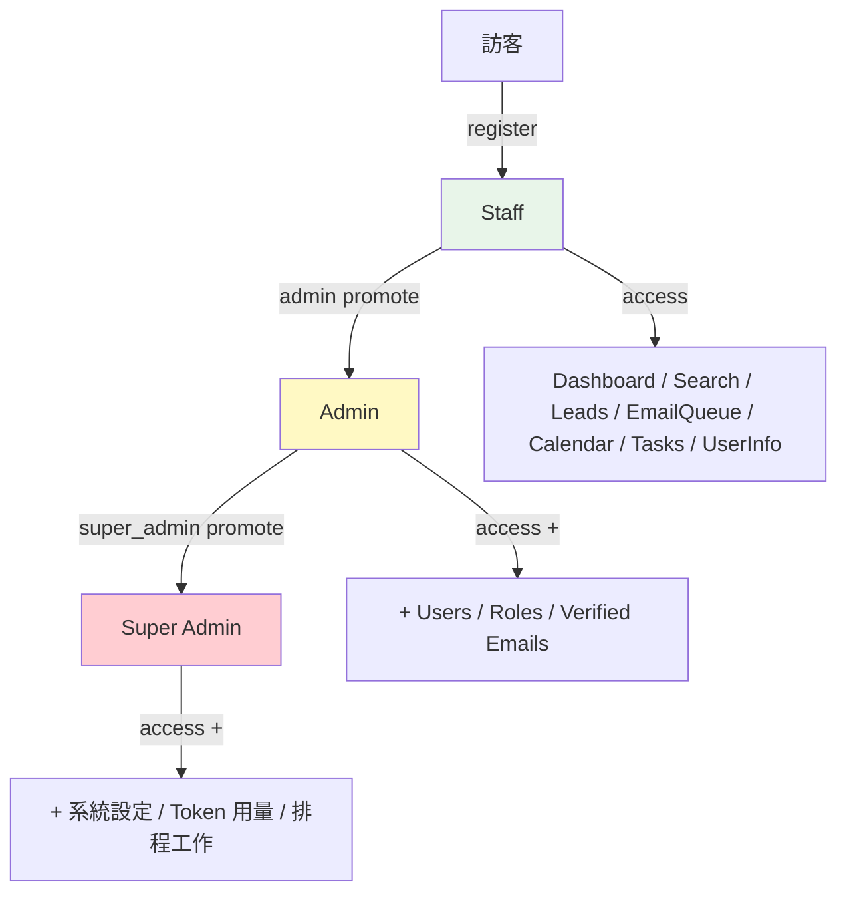
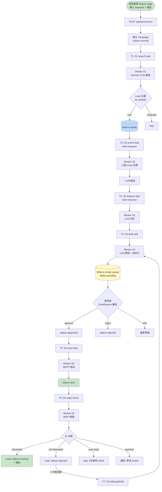
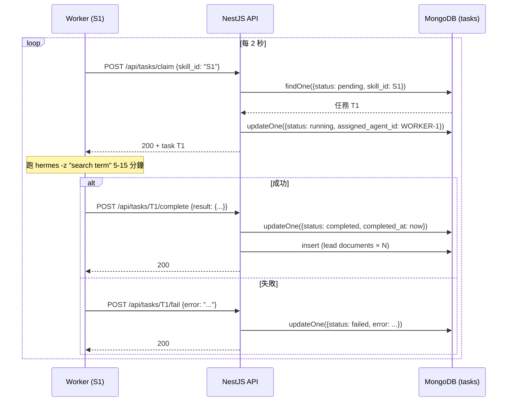
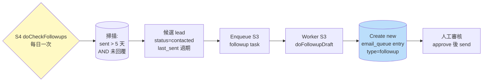
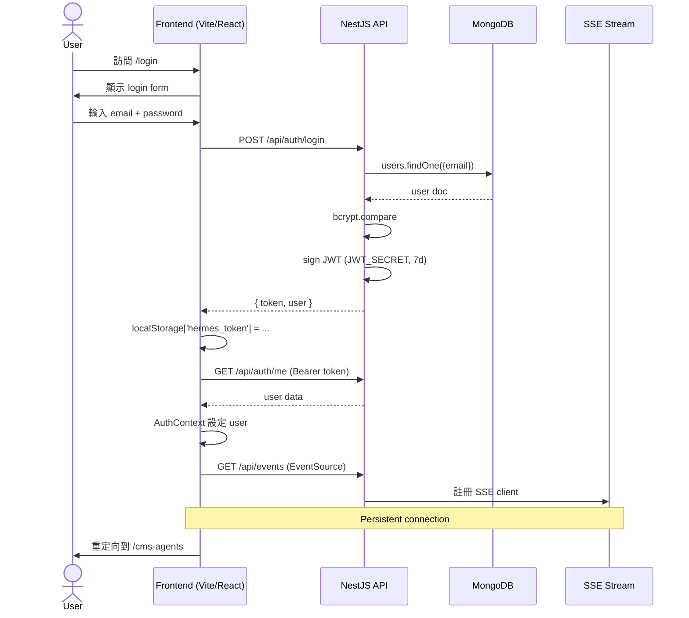
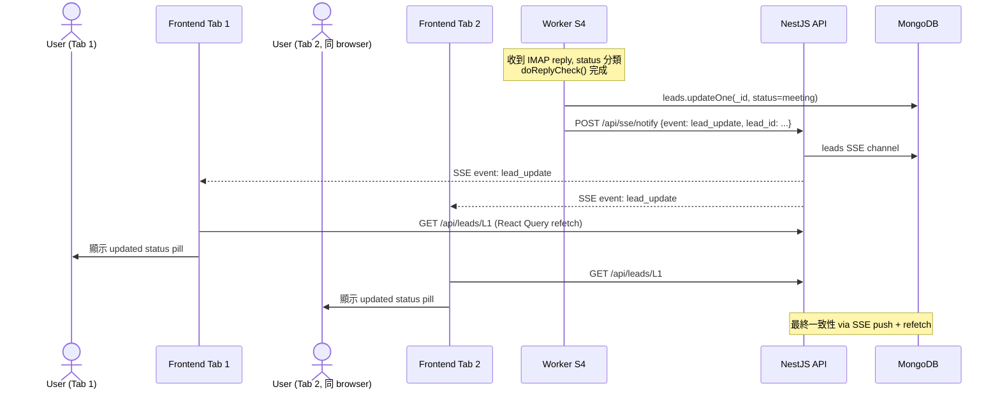
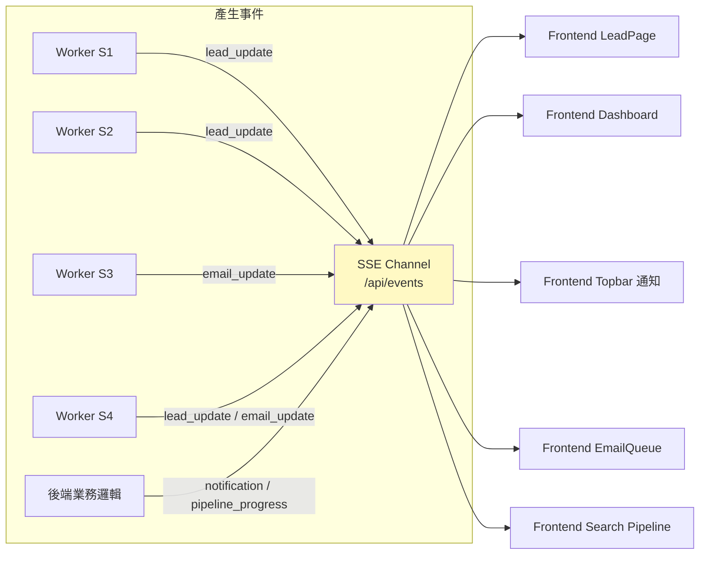
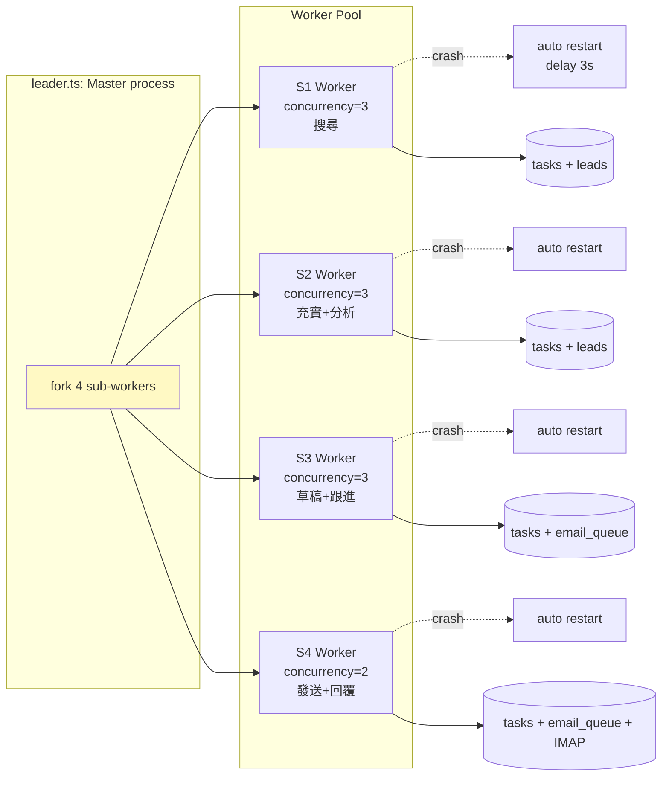

# ClientRadar AI — UAT 功能清單與系統流程圖

> **版本**：v1.0（2026-07-28）
> **對象**：UAT 測試團隊、系統管理員、上級主管
> **目的**：完整列出系統所有功能,並以圖示呈現流程關係

---

## 目錄

- [1. 系統定位](#1-系統定位)
- [2. 功能總覽(七大模組)](#2-功能總覽)
- [3. 功能清單(逐項)](#3-功能清單)
- [4. 角色與權限](#4-角色與權限)
- [5. 系統架構圖](#5-系統架構圖)
- [6. 核心業務流程](#6-核心業務流程)
- [7. 資料流時序圖](#7-資料流時序圖)
- [8. 即時通訊(SSE)事件流](#8-即時通訊事件流)
- [9. AI Worker 排程](#9-ai-worker-排程)
- [10. 部署拓樸](#10-部署拓樸)

---

## 1. 系統定位

**ClientRadar AI** 是一套結合像素風 UI 嘅 CRM + AI 自動化外展系統。核心能力係**用 LLM + 隱身瀏覽器去搵潛在客戶、撰寫個人化外展郵件、追蹤跟進**,從「開 lead 名單」到「預約會議」全自動。

**使用者對象**:
- **Sales / BD**:每日操作,搵新客、回覆、跟進。
- **Marketing Manager**:設定評分規則、查看數據儀表板。
- **Admin / Super Admin**:使用者管理、系統設定、角色權限。

**完成嘅核實路徑**:`輸入 keyword + 地區` → `數百條 verified leads + 自動發信 + 自動跟進 + 智能分類回覆`。

---

## 2. 功能總覽

系統由 **7 大模組**組成:

| # | 模組 | 功能摘要 |
|---|---|---|
| 1 | **認證 & 使用者** | 註冊、登入、改密碼、忘記密碼、Profile、角色管理 |
| 2 | **線索管理 (Leads)** | 三欄式 CRM,新增、編輯、狀態、AI 分析、再處理 |
| 3 | **AI Pipeline (Hermes)** | 搜尋 → 充實 → 分析 → 撰寫郵件 → 發送 → 回覆分類 |
| 4 | **郵件佇列 (Email Queue)** | LLM 草稿、人工審核、發送、跟進、重試 |
| 5 | **搜尋 (Search)** | 多來源觸發 + SSE 即時進度條 + Hero 結果卡 |
| 6 | **任務佇列 (Tasks)** | Worker 任務排程、claim/complete/fail 模式、統計 |
| 7 | **系統輔助** | 日曆、通知、Token 用量、檔案上傳、健康檢查、Swagger API 文件 |

---

## 3. 功能清單(逐項)

### 3.1 認證 & 使用者管理

| ID | 功能 | 路由 | 說明 |
|----|------|------|------|
| F1.1 | 註冊 | `POST /api/auth/register` | Email + 密碼 + 姓名 + 公司資料 |
| F1.2 | 登入 | `POST /api/auth/login` | JWT 發放,存 `hermes_token` localStorage |
| F1.3 | 取得當前使用者 | `GET /api/auth/me` | 用於初始化 user context |
| F1.4 | 改密碼 | `POST /api/auth/change-password` | 舊密碼驗證 |
| F1.5 | 忘記密碼 | `POST /api/auth/forgot-password` | Email 發送 reset link |
| F1.6 | 重設密碼 | `POST /api/auth/reset-password` | Token-based reset |
| F1.7 | 更新個人資料 | `PATCH /api/auth/profile` | 姓名、公司、語言偏好 |
| F1.8 | 角色管理 | `GET/POST/PATCH/DELETE /api/roles/*` | 定義角色 + 權限集合 |
| F1.9 | 使用者管理 | `GET/POST/PATCH/DELETE /api/users/*` | Admin 操作使用者清單 |
| F1.10 | 角色權限保護 | `RolesGuard + @Roles()` | Admin / Super Admin 路由保護 |

### 3.2 線索管理 (Leads)

| ID | 功能 | 路由 | 說明 |
|----|------|------|------|
| F2.1 | 線索列表(分頁) | `GET /api/leads` | 頁碼 + limit + 排序 + 過濾 |
| F2.2 | 線索詳情 | `GET /api/leads/:id` | 單筆完整資料 + emails |
| F2.3 | 新增線索 | `POST /api/leads` | 手動輸入 / 從搜尋結果匯入 |
| F2.4 | 編輯線索 | `PATCH /api/leads/:id` | 公司資料、聯絡資料 |
| F2.5 | 更新狀態 | `PATCH /api/leads/:id/status` | new / pending / contacted / rejected / meeting |
| F2.6 | 標記有興趣 | `POST /api/leads/:id/mark-interested` | 從 Webhook / IMAP 觸發 |
| F2.7 | 重新處理 | `POST /api/leads/:id/reprocess` | 重新跑 enrich / analyze / draft |
| F2.8 | 刪除單筆 | `DELETE /api/leads/:id` | 軟刪除(`_deleted_at`) |
| F2.9 | 批量刪除 | `DELETE /api/leads` | 多選 |
| F2.10 | 三欄式 UI(Agile CRM) | `/client-pool` | Left list / Center detail / Right actions |
| F2.11 | 已驗證郵箱池 | `/client-pool?view=verified` | 跨線索共享 email list |
| F2.12 | 線索狀態 pill | (UI) | 同色 pill 顯示,有 day-by-day 視覺統一 |

### 3.3 AI Pipeline (Hermes)

| ID | 功能 | 對應 Worker 任務 | 說明 |
|----|------|------|------|
| F3.1 | 啟動 Pipeline | `POST /api/hermes/run` | keyword + location + source + target_count |
| F3.2 | Campaign 狀態查詢 | `GET /api/hermes/campaigns/:id` | 進度、已完成數、lead_ids |
| F3.3 | S1 搜尋 | `doSearch()` | Google Maps / Search / LinkedIn via Hermes CUA |
| F3.4 | S2 充實 | `doEnrich()` | 三層:Node fetch / Hermes CUA / domain guess |
| F3.5 | S2 分析 | `doAnalyze()` | LLM 生成合作角度 + 服務匹配 |
| F3.6 | S3 草稿 | `doDraft()` | LLM 撰寫 + 自評 confidence 0-100 |
| F3.7 | S3 跟進草稿 | `doFollowupDraft()` | 5+ 天無回覆 → 跟進郵件 |
| F3.8 | S3 重新外展 | `doReoutreachDraft()` | 重試 / 升級外展 |
| F3.9 | S4 發送 | `doSend()` | Nodemailer SMTP(`ENABLE_REAL_SEND=true`) |
| F3.10 | S4 回覆分類 | `doReplyCheck()` | IMAP 掃描 + AI 分類 / meeting / auto-reply |
| F3.11 | S4 跟進排程 | `doCheckFollowups()` | 5 天無回覆 → 建 followup 任務 |
| F3.12 | 評分規則 | (Settings) | tone / length / must-include / 自訂 |

### 3.4 郵件佇列 (Email Queue)

| ID | 功能 | 路由 | 說明 |
|----|------|------|------|
| F4.1 | 列表 | `GET /api/email-queue` | 全部狀態 + 過濾 |
| F4.2 | 詳情 | `GET /api/email-queue/:id` | subject + body + draft_score |
| F4.3 | 編輯草稿 | `PATCH /api/email-queue/:id` | 編輯 subject / body |
| F4.4 | 審核通過 | `POST /api/email-queue/:id/approve` | `pending` → `approved` |
| F4.5 | 拒絕 | `POST /api/email-queue/:id/reject` | `pending` → `rejected` |
| F4.6 | 發送 | `POST /api/email-queue/:id/send` | `approved` → `sent`(Worker S4) |
| F4.7 | 模板編輯器 | `/cms-email-queue` | WYSIWYG 編輯 |

### 3.5 搜尋 (Search)

| ID | 功能 | 路由 | 說明 |
|----|------|------|------|
| F5.1 | 多來源搜尋 | `POST /api/search` | GMaps / Google / LinkedIn |
| F5.2 | 觸發 Hermes | `POST /api/hermes/run` | 入 Campaign + S1 task |
| F5.3 | SSE 即時進度 | `GET /api/events` | 階段更新、lead 完成數 |
| F5.4 | Hero 結果卡 | (UI) | 已找到 lead 即時 preview |
| F5.5 | 取消搜尋 | `POST /api/hermes/campaigns/:id/cancel` | kill running pipeline |

### 3.6 任務佇列 (Tasks)

| ID | 功能 | 路由 | 說明 |
|----|------|------|------|
| F6.1 | 任務列表 | `GET /api/tasks` | skill / status / assigned_agent 過濾 |
| F6.2 | 任務統計 | `GET /api/tasks/stats` | 各 skill pending / running / done |
| F6.3 | 任務詳情 | `GET /api/tasks/:taskId` | result + error |
| F6.4 | 新增任務 | `POST /api/tasks` | admin 手動建 |
| F6.5 | Worker claim | `POST /api/tasks/claim` | 按 `skill_id` claim |
| F6.6 | Worker 完成 | `POST /api/tasks/:taskId/complete` | 提交 result |
| F6.7 | Worker 失敗 | `POST /api/tasks/:taskId/fail` | 提交 error |

### 3.7 系統輔助

| ID | 功能 | 路由 / 位置 | 說明 |
|----|------|------|------|
| F7.1 | 日曆事件 CRUD | `/app-calendar` + `/api/calendar/*` | meeting / follow-up / deadline |
| F7.2 | 通知中心 | Topbar 鈴鐺 + SSE | i18n-key 翻譯 |
| F7.3 | Token 用量追蹤 | `/cms-settings?tab=tokens` | per user / per task |
| F7.4 | 檔案上傳 | `POST /api/uploads` | avatar / attachment |
| F7.5 | 系統設定(5 Tab) | `/cms-settings` | API key / scoring / schedule |
| F7.6 | 健康檢查 | `GET /api/health` | 監控用 |
| F7.7 | Swagger API 文件 | `/api/docs` | OpenAPI spec |
| F7.8 | 推播通知 (Web Push) | 瀏覽器層 | VAPID public key config |
| F7.9 | i18n(3 語) | 全站 | 繁中 / 簡中 / English |
| F7.10 | 深淺主題切換 | Topbar | localStorage 持久化 |
| F7.11 | Onboarding 新手教學 | 首次登入 | Spotlight + tooltip |

---

## 4. 角色與權限



**注意**:`PermissionsGuard` 而家**回傳 `true`**,role-based 細粒度控制尚未啟用。**部署前須 resolve**。

---

## 5. 系統架構圖

```mermaid
flowchart LR
    subgraph Client["Browser (UAT User)"]
        UI[React 19 + Vite<br>Pixel-themed UI]
    end
    
    subgraph WebServer["公司 Web Server (新)"]
        RP[Reverse Proxy<br>Nginx / Caddy]
    end
    
    subgraph FrontendBox["前端主機 (UAT)"]
        FE[Vite-built dist/<br>靜態檔]
    end
    
    subgraph BackendBox["Backend Mac (192.168.1.111)"]
        API[NestJS<br>:4000]
        WorkerA[Worker Leader<br>cms/worker]
        W1[Worker S1]
        W2[Worker S2]
        W3[Worker S3]
        W4[Worker S4]
    end
    
    subgraph HermesBox["Hermes AI Agent<br>(公司 Mac mini, 新位置)"]
        Hermes[Hermes CLI<br>LLM + CUA Browser]
        HermesDB[(~/.hermes/<br>skills + state.db<br>+ config.yaml)]
    end
    
    DB[(MongoDB<br>lead_scraper)]
    
    UI -->|HTTPS| RP
    RP -->|/| FE
    RP -->|/api/*| API
    RP -->|/api/events (SSE)| API
    
    API <-->|tasks/claim,complete| WorkerA
    WorkerA --> W1
    WorkerA --> W2
    WorkerA --> W3
    WorkerA --> W4
    
    W1 -.->|hermes -z<br>spawn child| Hermes
    W2 -.->|hermes -z| Hermes
    W3 -.->|hermes -z| Hermes
    W4 -.->|IMAP + SMTP only| MailServer[Gmail SMTP/IMAP]
    
    API -->|Mongoose| DB
    WorkerA -->|mongodb driver| DB
    Hermes -->|讀 ~/.hermes/| HermesDB
    
    style Hermes fill:#ffe0b2
    style BackendBox fill:#e3f2fd
    style FrontendBox fill:#f3e5f5
    style HermesBox fill:#fff3e0
```

**重點**:
- **Frontend / Backend / Hermes** 將獨立部署於 3 個不同主機
- 只有 Backend 同 Hermes share MongoDB
- Frontend 透過 Reverse Proxy 同時 serve static + proxy API

---

## 6. 核心業務流程

### 6.1 主 Pipeline:搜尋 → 發信 → 回覆追蹤



### 6.2 任務 claim / complete 模式



### 6.3 自動 followup 排程



---

## 7. 資料流時序圖

### 7.1 使用者登入 → 看到首頁



### 7.2 Lead state 變更即時同步 UI



---

## 8. 即時通訊(SSE)事件流

### 8.1 SSE 通道總覽



### 8.2 事件類型一覽

| 事件 | 來源 | 觸發條件 | 前端處理 |
|------|------|---------|---------|
| `lead_update` | Worker S1/S2/S4 + 後端 | lead 狀態變更 / 新增 | React Query invalidate `['leads']` |
| `email_update` | Worker S3/S4 + 後端 | 草稿 / approve / send | React Query invalidate `['email-queue']` |
| `pipeline_progress` | Hermes run campaign | Campaign stage 變化 | Search page 進度條 |
| `notification` | 後端 / Worker | 新通知寫入 | Badge 計數 + 鈴鐺 panel |
| `hermes_log` | Worker 寫 AI log | Hermes stderr | Debug viewer |
| `ping` | Server 每 15s | keepalive | reconnect 計時 |

---

## 9. AI Worker 排程



---

## 10. 部署拓樸

### 10.1 UAT 部署佈局

```mermaid
flowchart TB
    subgraph Internet["公司對外網絡"]
        Domain[uat.clientradar-ai.com]
    end
    
    subgraph DMZ["公司 DMZ / Frontend Server"]
        Nginx[Nginx Reverse Proxy<br>TLS from 公司 cert]
        Static[dist/ 靜態前端]
    end
    
    subgraph Internal["辦公室內網"]
        Frontend[Frontend Mac<br>serves :5173 → dist]
        Backend[Backend Mac<br>192.168.1.111<br>NestJS :4000]
        Worker[Worker Mac<br>cms/worker<br>(將移去新機)]
        Hermes[新 Hermes Mac mini<br>Hermes CLI + CUA]
    end
    
    Domain --> Nginx
    Nginx --> Static
    Nginx -->|location /api/*| Backend
    Nginx -->|location /api/events| Backend
    
    Backend --> Worker
    Worker -.spawn.-> Hermes
    
    Backend <-->|Mongoose| MongoDB[(MongoDB<br>內網或 Atlas)]
    
    style Internal fill:#f3e5f5
    style Hermes fill:#ffe0b2
```

### 10.2 部署 Phase 規劃

| Phase | 範圍 | 部署前置 |
|-------|------|---------|
| P0 | Frontend (Vite-built) 推上 UAT 域名 | 前端 SPA 用 Nginx serve static |
| P1 | Nginx `/api/*` reverse proxy 到內網 Backend Mac | 後端維持現位(192.168.1.111) |
| P2 | Worker 部署到 Backend Mac(或獨立 Worker Mac) | 透過 MongoDB 同 Backend 通訊 |
| P3 | Hermes AI Agent 搬至公司新 Mac mini | port-forward 出 network access |

**P3 嘅 plug-and-play 步驟見 companion 文件**:`docs/uat-deployment-runbook.md`

---

## 附錄 A:檔案總覽

| 文件 | 用途 |
|------|------|
| `docs/uat-functional-spec.md` | 本文件 |
| `docs/uat-deployment-runbook.md` | Hermes 換 Mac mini + plug-and-play 步驟 |
| `HANDOVER.md` | 完整技術交接文件(已有) |
| `PROJECT.md` | 專案 high-level overview(已有) |

---

**版本歷程**
- v1.0(2026-07-28):初版,涵蓋 P0-P3 UAT 部署所需的全系統描述
